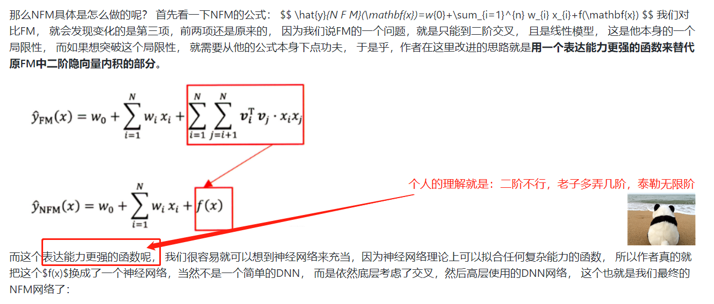
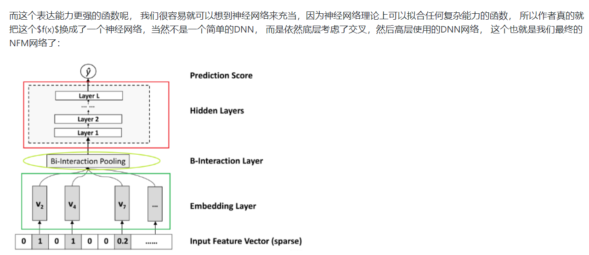
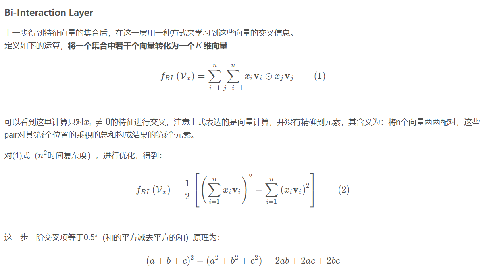
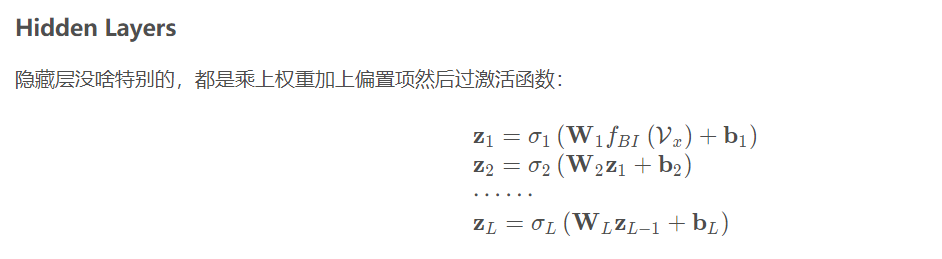

NFM可以看做是主要针对FM和FNN的改进，他们缺点如下:
FM模型虽然学习到了交叉特征，但是对于交叉后的特征仍然是线性建模，学习不到非线性的关系
FNN模型虽然在底层用的FM进行向量初始化，在上层使用DNN来学习到高阶非线性特征，但是单个特征embedding后通过拼接（concatenating），然后在后续的DNN结构中学习到交叉特征（deep& wide和deep cross也是如此），但是在实际应用中，这种方法对于交叉特征的学习不尽人意。
所以需要一个模型既能学习到高阶特征，又能学习到非线性关系，因此提出了NFM模型。

    class BiInteractionPooling(Layer):
        def __init__(self):
            super(BiInteractionPooling, self).__init__()

        def call(self, inputs):
            # 优化后的公式为： 0.5 * （和的平方-平方的和）  =>> B x k
            concated_embeds_value = inputs  # B x n x k

            square_of_sum = tf.square(tf.reduce_sum(concated_embeds_value, axis=1, keepdims=False))  # B x k
            sum_of_square = tf.reduce_sum(concated_embeds_value * concated_embeds_value, axis=1, keepdims=False)  # B x k
            cross_term = 0.5 * (square_of_sum - sum_of_square)  # B x k

            return cross_term

        def compute_output_shape(self, input_shape):
            return (None, input_shape[2])

参考：
https://blog.csdn.net/dpengwang/article/details/106549204
https://github.com/datawhalechina/team-learning-rs/blob/master/DeepRecommendationModel/NFM.md