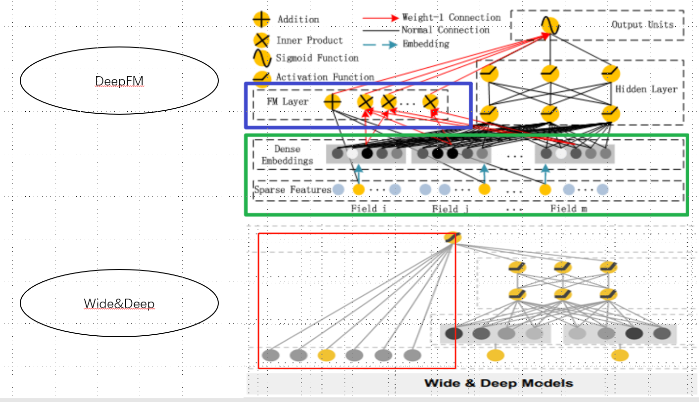
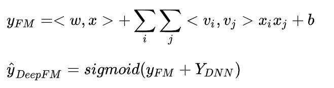
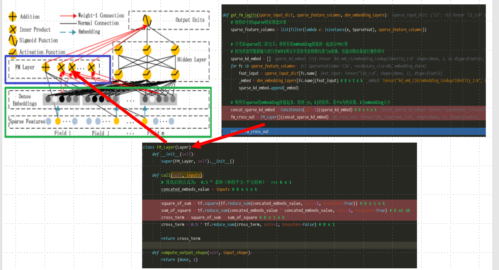
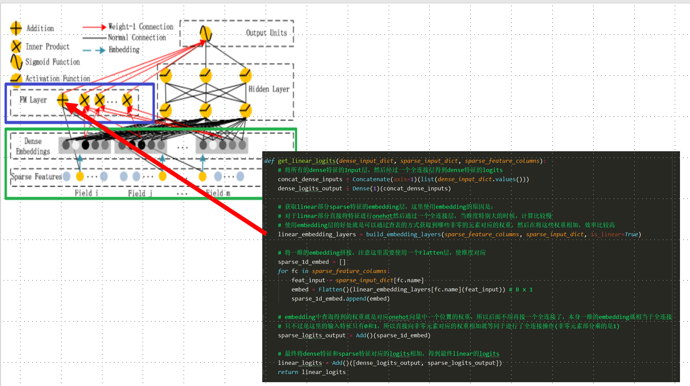
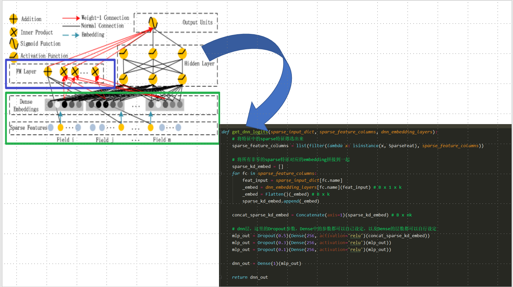

## deepfm 与 wide&deep的区别

1）两者的DNN部分模型结构相同；

2）wide&deep需要做特征工程，二阶特征交叉需要靠特征工程来实现，通过wide部分发挥作用；

3）DeepFM完全不需要做特征工程，直接输入原始特征即可，二阶特征交叉靠FM来实现，并且FM和DNN共享相同的embedding；

4）从试验结果来看DeepFM效果优于wide&deep。

FM模型中黑色线表示带有权重的连接，红色线表示权重为1的连接，蓝色线表示one-hot映射到对应的embedding。图中的Field表示一个特征类别，比如手机型号是一个field，性别是一个field，地理位置是一个field。每个field用one-hot表示，构成最下面的Sparse Features。稀疏特征有两部分输出，一部分是加权求和得到FM Layer中的第一个节点，另一部分索引对应的embedding得到Dense Embeddings。Dense Embeddings也有两部分输出，一部分是两两做点积输出到FM Layer，另外一部分是拼接起来作为Hidden Layer的输入。
Sparse Feature中黄色表示1，蓝色表示1

DeepFM公式如下图一部分是因子分解机FM，一部分是DNN，DNN和上面介绍的deep部分是相同的。需要注意的是，FM和DNN共享embedding。论文中做过试验，将FM和DNN的embedding相互独立，效果要差。关于DeepFM论文给出的物理意义是，FM部分负责一阶特征和二阶交叉特征，而DNN部分负责二阶以上的高阶特征交叉。

## 代码部分结构分解

